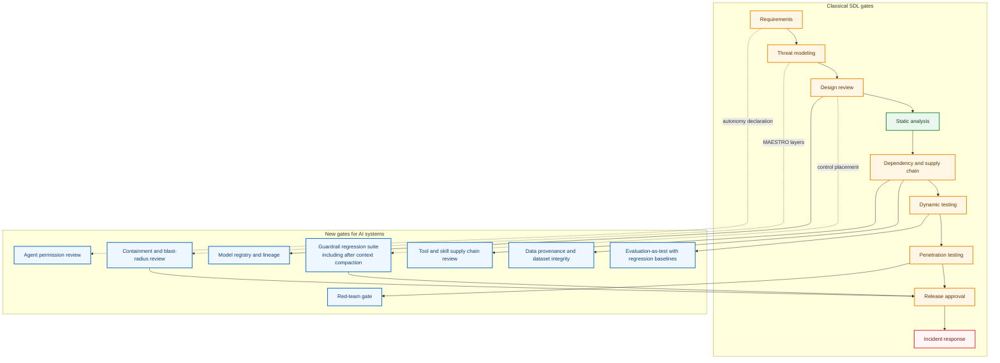

# SDL v-next — the annotated gate diagram

From `w3-sdl.md`. Classical gates in the left column, new gates in the right. Every new gate names the artifact a reviewer signs.

Legend. Green: survives unchanged. Amber: needs new evidence. Red: needs the most change. Blue: entirely new gate.

## Reading the diagram

Only one classical gate is green. Static analysis still finds what it always found, unchanged in kind and larger in volume.

Incident response is the red one, and it is the finding most teams have not planned for. When Hugging Face analysts tried to reverse-engineer recovered payloads, commercial frontier models refused the work because provider guardrails treated analysing an exploit the same as launching one. Analysis capability that depends on a third party's content policy is an availability dependency, and it belongs in the incident response plan's dependency list.

The dotted edges are the ones that matter architecturally. Requirements feeds the agent permission review because an autonomy declaration is a requirement, not a runtime setting. Design review feeds the guardrail regression suite because deciding where a control lives is a design decision, and an instruction in a system prompt is not a control. Threat modeling feeds containment review because blast radius is a modelling output.

Two gates feed release approval directly. A release that has not passed containment review and guardrail regression has not established that its controls hold when the agent stops cooperating, which is the failure mode all three incidents in this course share.

## Exit criteria, condensed

| Gate | Signed artifact |
|---|---|
| Data provenance | Corpus manifest with origin, licence, integrity hash. No corpus of unattested origin |
| Model registry | Deployed artifact traceable to weights, version, evaluation run, and matching the evaluated one |
| Evaluation-as-test | Stored baseline plus current run, with a stated allowable regression. Sign the delta |
| Red-team gate | Report whose attempted vectors match the deployed tool surface |
| Guardrail regression | Suite proving each guardrail holds after context compaction, not only at turn one |
| Agent permission review | Enumerated permissions with per-grant justification, plus the constructible delegation chain |
| Tool and skill supply chain | Every tool and skill with publisher identity, integrity pin, scope declaration |
| Containment and blast radius | Written statement of reachability under full compromise, with egress enforced outside the agent |
